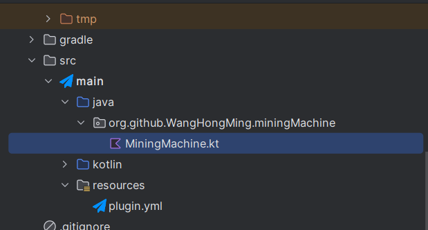

## Contribute
If you want to contribute this project
you can modify code from 

src/main/java/org/github/WangHongMing/miningMachine/MiningMachine.kt

Then you can using Eclipse or IntelliJ to change code

very appreciate

## Todo:
[x] Fix meet air cant forward  
- [X] Fix when break machine , it can't stop
[] Check does mining machine can break bedrock??
[] When i broken mining machine it still cost coal energe

[ ] When oil cost all stop event 
[ ] When Broken Mining machine stop event  
- [ ] If in front of the mining machine will dead(get hurt)
- [ ] store item to a box pre setting 
- [ ] design the usage permission
- [ ] Let Machine had Durability

## Cloud
- [ ] put minecraft data to docker
- [ ] at cloud service using docker deploy Minecraft server
- [ ] Using K8S to manage minecraft server , auto anotation and auto scale
